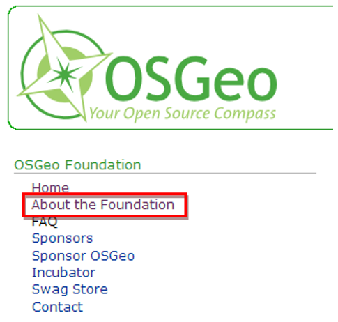
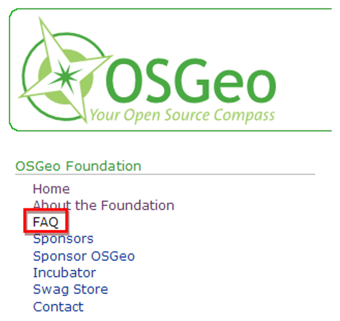

# GST 101: Introduction to Geospatial Technology
## Lab 0 - Getting to Know FOSS and FOSS4G
### Objective – Explore and Understand FOSS Software Fundamentals and QGIS Help Resources

Document Version: 3/11/2015

**FOSS4G Lab Author:**
Kurt Menke, GISP
Bird's Eye View GIS

---

The development of the original document is funded by the Department of Labor (DOL) Trade Adjustment Assistance Community College and Career Training (TAACCCT) Grant No.  TC-22525-11-60-A-48; The National Information Security, Geospatial Technologies Consortium (NISGTC) is an entity of Collin College of Texas, Bellevue College of Washington, Bunker Hill Community College of Massachusetts, Del Mar College of Texas, Moraine Valley Community College of Illinois, Rio Salado College of Arizona, and Salt Lake Community College of Utah.  This work is licensed under the Creative Commons Attribution 3.0 Unported License.  To view a copy of this license, visit http://creativecommons.org/licenses/by/3.0/ or send a letter to Creative Commons, 444 Castro Street, Suite 900, Mountain View, California, 94041, USA.  

This document was original modified from its original form by Kurt Menke and continues to be modified and improved by generous public contributions.

---

### 1. Introduction

In this lab, students will become familiar with the definitions of Free Software, Open Source Software, and the online resources available for FOSS4G software.

This lab includes the following tasks:

+ Task 1 – Explore the Free Software Foundation and Open Source Initiative websites and become familiar with both definitions.
+ Task 2 - Become familiar with OsGeo and their stance on Commercial and Proprietary Software.
+ Task 3 - Explore available FOSS4G software packages.
+ Task 4 - Become familiar with the support resources available for QGIS.

In the last 10 years there has been an explosion of open source GIS software projects.  This exercise will begin by introducing the main web portals to the Free  Software and Open Source Initiatives. It will then cover some of the main Free and Open Source For Geospatial (FOSS4G) resources with an emphasis on QGIS. 

Answer all questions in **bold text**.

### 2. Objective: Understand Free and Open Source Software

The difference between Free, Open Source and Proprietary software lies in the licenses. Here you will visit both the Free Software Foundation and Open Source Initiative websites and read about their licenses. For each website, you will answer questions listed in bold.

### Task 1 - Explore the Free Software Foundation and Open Source Initiative

Both of these organizations have played a big role in the development of FOSS software.

1. In a web browser, navigate to [http://www.fsf.org/](http://www.fsf.org/), the website for the Free Software Foundation.
2. **What are Stallman's four freedoms?**
3. In a web browser, navigate to [http://producingoss.com/en/introduction.html#free-vs-open-source](http://producingoss.com/en/introduction.html#free-vs-open-source) and read the "Free" Versus "Open Source" section of Karl Fogel's ["Producing Open Source Software"](http://producingoss.com/en/index.html) book.
3. In a web browser, navigate to [http://opensource.org/](http://opensource.org/), the website for the Open Source Initiative.
4. **List the 10 components of the Open Source Definition.**

###Task 2 - Become familiar with OSGeo

1. In a web browser, navigate to [http://www.osgeo.org](http://www.osgeo.org/), the website for OSGeo.
2. Click on the About the Foundation link (shown in the figure below).

3. **Describe OSGeo in your own words.**
4. Click on the FAQ link (shown in the figure below). These are the frequently asked questions for OSGeo. Many of your initial questions will be answered here. Now you'll read about what OSGeo considers Commercial software and what they think of Proprietary software.

5. Scroll down until you see the Open Source heading.
6. **What is OSGeo's stance on Commercial Software? **
7. **What is OSGeo's stance on Proprietary Software?**
8.  **What is their distinction between "Open Source Software" and "Free Software"?**
9. Scroll to the top of the page. Notice the OSGeo Projects box on the right hand side of the web page. These are the projects that have been incubated as OSGeo projects. For a project to be accepted by OSGeo, it must meet certain standards in terms  of project management, the software documentation, and the content of the web page. In this course you will be using a desktop GIS software called QGIS.
10. **Is QGIS listed as a an OSGeo Project?**
11. Remember that FOSS4G stands for free and open source for geospatial. OSGeo organizes annual gatherings for users of FOSS4G software named simply FOSS4G. 
12. In a web browser, navigate to [http://www.foss4g.org](http://www.foss4g.org/), the website for FOSS4G annual gatherings. for FOSS4G.  This is the site for all FOSS4G events. The current conference is listed, as well as past events. 
13. **When and where will FOSS4G be held next?**

###Task 3 - Exploring available FOSS4G software packages

This course will focus on one piece of FOSS GIS software, QGIS. However, there are many different FOSS softwares available. 

1. In a web browser, navigate to [http://live.osgeo.org/en/overview/overview.html](http://live.osgeo.org/en/overview/overview.html), the overview page for the OSGeo Live project.
2. Find a project that looks interesting to you.  
3. Click on the link for that project to open the web page for that software. You can also click on the QuickStart link to see a visual quick start guide.
4. **Write a brief description of what the software does or what it is designed for along with its name.**

###Task 4 - Become familiar online QGIS support

1. From the OSGeo website locate the OSGeo Projects box on the right hand side. Look for the Desktop Applications heading and click on the QGIS link. This will open the QGIS website.
2.	Click on Discover QGIS (shown in figure below).

3. **Describe QGIS.**
5. Click on the QGIS Features link underneath the DISCOVER heading.
6. Click on the [Take the QGIS feature tour link](http://docs.qgis.org/latest/en/docs/user_manual/preamble/features.html).
7. **List and describe the first two QGIS features listed**.
8. Click Discover QGIS to return to the main table of contents. Find the Table of Contents on the left hand side, and click on the [Case Studies](http://qgis.osgeo.org/en/site/about/case_studies/index.html) link. 
9. **Find a Case Study that interests you. Read it and write a short paragraph explaining the who, what, when and where of the case study.**
10. From the Table of Contents (on the left hand side) click on [QGIS blogs](http://plugins.qgis.org/planet/).
11. The QGIS blogs page will open in a new browser tab and is called QGIS Planet.
12. This QGIS blog page has regular updates and news about the project. The blog page also lists third party private blogs about QGIS on the Blog List on the left hand side. This is a good source of QGIS related news. 
13. Close the QGIS Planet tab in your browser. 
14. You should now be back at the initial QGIS tab in your browser. 
15. Click on the For Users link at the top of the page. 
16. Click on the Download QGIS [link](http://qgis.osgeo.org/en/site/forusers/download.html). 
17. Notice that there are versions of QGIS available for all major operating systems (Windows / Mac OS X /  Linux / BSD / Android). You can install QGIS freely on any computer you like by downloading the appropriate installer and running the install program. 
18. Click on the Sources tab.
19. **Is the source code available for download?**
20. Click the Get Involved link at the top of the page. 
21. Click on the List of QGIS Support Channels link. 
22. From here you can subscribe to email lists, search email lists, and connect to the QGIS community via chats or local user groups. Email lists are a great way to get support once you have completed your course work and you need additional help to complete a GIS task. If you choose, you can subscribe to the QGIS User email list.
23. Click the Documentation link at the top of the page.
24. This is where you can find the official QGIS documentation. 
25. **Describe the support documentation available for QGIS.**

###5. Conclusion
The help resources are another way FOSS differs from proprietary software. With proprietary software, there is typically a dedicated help phone line, or online help resource, that connects you with the vendor. The software license fee covers this support. With FOSS software, the community provides the support services online. For example, QGIS has many online help options. Familiarizing yourself with these will help as you complete your coursework and move forward with your career.

This lab has only scratched the surface with regards to the number of FOSS4G software. There are many organizations and groups doing great work like [Location Tech](http://www.locationtech.org/), [Apache SIS](http://sis.apache.org/), and [R-Spatial](http://rspatial.r-forge.r-project.org/), to name a few.